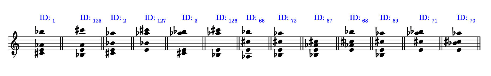

# instrumentor

## Description

`instrumentor.py` is a Python module for exploring, generating, and visualizing note positions and chord voicings on stringed instruments (such as guitar), leveraging Prolog logic via `pyswip` and music notation with `abjad`. It allows you to model custom fretboards, find all positions for a note, generate chord voicings, filter them, extract notes, and visualize results as music notation.

---

## Installation

Make sure you have installed:
- Python 3.11
- [pyswip](https://github.com/yuce/pyswip)
- [abjad](https://abjad.github.io/)
- numpy, matplotlib

---

## Usage Guide

### 1. Import and initialize

```python
from instrumentor import FretboardExplorer

guitar = FretboardExplorer()
```
---

### 2. Build the fretboard

```python
guitar.liutaio(6,22,[40, 45, 50, 55, 59, 64]) # Building the neck of a 6-string guitar with 22 frets in standard tuning (in MIDI)

```

---

### 3. Find positions for a note

```python
guitar.all_positions("Do#",0,1) # find all Do# possible in every position and octave
guitar.all_positions("Do#3",1,1) # find all possible positions for Do#3
```
#### Example output:
```
Do#; 11 posizioni trovate:
Corda: 1, Tasto: 9, Pitch: Do#2, Tipo: CT
Corda: 1, Tasto: 21, Pitch: Do#3, Tipo: CT
Corda: 2, Tasto: 4, Pitch: Do#2, Tipo: CT
Corda: 2, Tasto: 16, Pitch: Do#3, Tipo: CT
Corda: 3, Tasto: 11, Pitch: Do#3, Tipo: CT
Corda: 4, Tasto: 6, Pitch: Do#3, Tipo: CT
Corda: 4, Tasto: 18, Pitch: Do#4, Tipo: CT
Corda: 5, Tasto: 2, Pitch: Do#3, Tipo: CT
Corda: 5, Tasto: 14, Pitch: Do#4, Tipo: CT
Corda: 6, Tasto: 9, Pitch: Do#4, Tipo: CT
Corda: 6, Tasto: 21, Pitch: Do#5, Tipo: CT
```

```
Do#3; 5 posizioni trovate:
Corda: 1, Tasto: 21, Tipo: CT
Corda: 2, Tasto: 16, Tipo: CT
Corda: 3, Tasto: 11, Tipo: CT
Corda: 4, Tasto: 6, Tipo: CT
Corda: 5, Tasto: 2, Tipo: CT
```


---

### 4. Generate chord voicings and visualize in musical notation

```python
chord = guitar.all_voicings(["Do#","Mi","Sol#","La#"])

for voicing in chord[0]:
    print(voicing)

guitar.chord_plotter(chord)

```

#### Example output:
```
139 rivolti trovati per le note ['Do#', 'Mi', 'Sol#', 'La#']:
(('Corda: 1, Tasto: 9, Pitch: Do#2, Tipo: CT', 'Corda: 2, Tasto: 7, Pitch: Mi2, Tipo: CT', 'Corda: 3, Tasto: 6, Pitch: Sol#2, Tipo: CT', 'Corda: 6, Tasto: 6, Pitch: La#3, Tipo: CT'), 1)
(('Corda: 1, Tasto: 9, Pitch: Do#2, Tipo: CT', 'Corda: 2, Tasto: 7, Pitch: Mi2, Tipo: CT', 'Corda: 5, Tasto: 9, Pitch: Sol#3, Tipo: CT', 'Corda: 3, Tasto: 8, Pitch: La#2, Tipo: CT'), 2)
(('Corda: 1, Tasto: 9, Pitch: Do#2, Tipo: CT', 'Corda: 2, Tasto: 7, Pitch: Mi2, Tipo: CT', 'Corda: 5, Tasto: 9, Pitch: Sol#3, Tipo: CT', 'Corda: 6, Tasto: 6, Pitch: La#3, Tipo: CT'), 3)
(('Corda: 1, Tasto: 9, Pitch: Do#2, Tipo: CT', 'Corda: 4, Tasto: 9, Pitch: Mi3, Tipo: CT', 'Corda: 2, Tasto: 11, Pitch: Sol#2, Tipo: CT', 'Corda: 3, Tasto: 8, Pitch: La#2, Tipo: CT'), 4)
(('Corda: 1, Tasto: 9, Pitch: Do#2, Tipo: CT', 'Corda: 4, Tasto: 9, Pitch: Mi3, Tipo: CT', 'Corda: 2, Tasto: 11, Pitch: Sol#2, Tipo: CT', 'Corda: 5, Tasto: 11, Pitch: La#3, Tipo: CT'), 5)
(('Corda: 1, Tasto: 9, Pitch: Do#2, Tipo: CT', 'Corda: 4, Tasto: 9, Pitch: Mi3, Tipo: CT', 'Corda: 3, Tasto: 6, Pitch: Sol#2, Tipo: CT', 'Corda: 6, Tasto: 6, Pitch: La#3, Tipo: CT'), 6)
(('Corda: 1, Tasto: 9, Pitch: Do#2, Tipo: CT', 'Corda: 4, Tasto: 9, Pitch: Mi3, Tipo: CT', 'Corda: 5, Tasto: 9, Pitch: Sol#3, Tipo: CT', 'Corda: 3, Tasto: 8, Pitch: La#2, Tipo: CT'), 7)
(('Corda: 1, Tasto: 9, Pitch: Do#2, Tipo: CT', 'Corda: 4, Tasto: 9, Pitch: Mi3, Tipo: CT', 'Corda: 5, Tasto: 9, Pitch: Sol#3, Tipo: CT', 'Corda: 6, Tasto: 6, Pitch: La#3, Tipo: CT'), 8)
(('Corda: 1, Tasto: 9, Pitch: Do#2, Tipo: CT', 'Corda: 6, Tasto: 0, Pitch: Mi3, Tipo: CV', 'Corda: 2, Tasto: 11, Pitch: Sol#2, Tipo: CT', 'Corda: 3, Tasto: 8, Pitch: La#2, Tipo: CT'), 9)
(('Corda: 1, Tasto: 9, Pitch: Do#2, Tipo: CT', 'Corda: 6, Tasto: 0, Pitch: Mi3, Tipo: CV', 'Corda: 2, Tasto: 11, Pitch: Sol#2, Tipo: CT', 'Corda: 5, Tasto: 11, Pitch: La#3, Tipo: CT'), 10)
(('Corda: 1, Tasto: 9, Pitch: Do#2, Tipo: CT', 'Corda: 6, Tasto: 0, Pitch: Mi3, Tipo: CV', 'Corda: 5, Tasto: 9, Pitch: Sol#3, Tipo: CT', 'Corda: 3, Tasto: 8, Pitch: La#2, Tipo: CT'), 11)
(('Corda: 1, Tasto: 9, Pitch: Do#2, Tipo: CT', 'Corda: 6, Tasto: 12, Pitch: Mi4, Tipo: CT', 'Corda: 2, Tasto: 11, Pitch: Sol#2, Tipo: CT', 'Corda: 5, Tasto: 11, Pitch: La#3, Tipo: CT'), 12)
(('Corda: 1, Tasto: 21, Pitch: Do#3, Tipo: CT', 'Corda: 2, Tasto: 19, Pitch: Mi3, Tipo: CT', 'Corda: 3, Tasto: 18, Pitch: Sol#3, Tipo: CT', 'Corda: 6, Tasto: 18, Pitch: La#4, Tipo: CT'), 13)
(('Corda: 1, Tasto: 21, Pitch: Do#3, Tipo: CT', 'Corda: 2, Tasto: 19, Pitch: Mi3, Tipo: CT', 'Corda: 5, Tasto: 21, Pitch: Sol#4, Tipo: CT', 'Corda: 3, Tasto: 20, Pitch: La#3, Tipo: CT'), 14)
(('Corda: 1, Tasto: 21, Pitch: Do#3, Tipo: CT', 'Corda: 2, Tasto: 19, Pitch: Mi3, Tipo: CT', 'Corda: 5, Tasto: 21, Pitch: Sol#4, Tipo: CT', 'Corda: 6, Tasto: 18, Pitch: La#4, Tipo: CT'), 15)
(('Corda: 1, Tasto: 21, Pitch: Do#3, Tipo: CT', 'Corda: 4, Tasto: 21, Pitch: Mi4, Tipo: CT', 'Corda: 3, Tasto: 18, Pitch: Sol#3, Tipo: CT', 'Corda: 6, Tasto: 18, Pitch: La#4, Tipo: CT'), 16)
(('Corda: 1, Tasto: 21, Pitch: Do#3, Tipo: CT', 'Corda: 4, Tasto: 21, Pitch: Mi4, Tipo: CT', 'Corda: 5, Tasto: 21, Pitch: Sol#4, Tipo: CT', 'Corda: 3, Tasto: 20, Pitch: La#3, Tipo: CT'), 17)
(('Corda: 1, Tasto: 21, Pitch: Do#3, Tipo: CT', 'Corda: 4, Tasto: 21, Pitch: Mi4, Tipo: CT', 'Corda: 5, Tasto: 21, Pitch: Sol#4, Tipo: CT', 'Corda: 6, Tasto: 18, Pitch: La#4, Tipo: CT'), 18)
(('Corda: 1, Tasto: 21, Pitch: Do#3, Tipo: CT', 'Corda: 6, Tasto: 0, Pitch: Mi3, Tipo: CV', 'Corda: 5, Tasto: 21, Pitch: Sol#4, Tipo: CT', 'Corda: 3, Tasto: 20, Pitch: La#3, Tipo: CT'), 19)
(('Corda: 2, Tasto: 4, Pitch: Do#2, Tipo: CT', 'Corda: 1, Tasto: 0, Pitch: Mi1, Tipo: CV', 'Corda: 3, Tasto: 6, Pitch: Sol#2, Tipo: CT', 'Corda: 4, Tasto: 3, Pitch: La#2, Tipo: CT'), 20)

. . .

```
#### Example image:

[Full PDF](examples/chord_visualization.pdf)

---

### 5. Filter voicings by fret and visualize in musical notation

```python

chord_filtered = guitar.voicings_filter(chord,7)

for voicing in chord_filtered:
    print(voicing)

guitar.chord_plotter(chord_filtered)

```

#### Example output:
```
139 rivolti trovati per le note ['Do#', 'Mi', 'Sol#', 'La#']:
13 rivolti trovati che includono il tasto 7:
(('Corda: 1, Tasto: 9, Pitch: Do#2, Tipo: CT', 'Corda: 2, Tasto: 7, Pitch: Mi2, Tipo: CT', 'Corda: 3, Tasto: 6, Pitch: Sol#2, Tipo: CT', 'Corda: 6, Tasto: 6, Pitch: La#3, Tipo: CT'), 1)
(('Corda: 6, Tasto: 9, Pitch: Do#4, Tipo: CT', 'Corda: 2, Tasto: 7, Pitch: Mi2, Tipo: CT', 'Corda: 3, Tasto: 6, Pitch: Sol#2, Tipo: CT', 'Corda: 1, Tasto: 6, Pitch: La#1, Tipo: CT'), 125)
(('Corda: 1, Tasto: 9, Pitch: Do#2, Tipo: CT', 'Corda: 2, Tasto: 7, Pitch: Mi2, Tipo: CT', 'Corda: 5, Tasto: 9, Pitch: Sol#3, Tipo: CT', 'Corda: 3, Tasto: 8, Pitch: La#2, Tipo: CT'), 2)
(('Corda: 6, Tasto: 9, Pitch: Do#4, Tipo: CT', 'Corda: 2, Tasto: 7, Pitch: Mi2, Tipo: CT', 'Corda: 5, Tasto: 9, Pitch: Sol#3, Tipo: CT', 'Corda: 3, Tasto: 8, Pitch: La#2, Tipo: CT'), 127)
(('Corda: 1, Tasto: 9, Pitch: Do#2, Tipo: CT', 'Corda: 2, Tasto: 7, Pitch: Mi2, Tipo: CT', 'Corda: 5, Tasto: 9, Pitch: Sol#3, Tipo: CT', 'Corda: 6, Tasto: 6, Pitch: La#3, Tipo: CT'), 3)
(('Corda: 6, Tasto: 9, Pitch: Do#4, Tipo: CT', 'Corda: 2, Tasto: 7, Pitch: Mi2, Tipo: CT', 'Corda: 5, Tasto: 9, Pitch: Sol#3, Tipo: CT', 'Corda: 1, Tasto: 6, Pitch: La#1, Tipo: CT'), 126)
(('Corda: 4, Tasto: 6, Pitch: Do#3, Tipo: CT', 'Corda: 2, Tasto: 7, Pitch: Mi2, Tipo: CT', 'Corda: 1, Tasto: 4, Pitch: Sol#1, Tipo: CT', 'Corda: 6, Tasto: 6, Pitch: La#3, Tipo: CT'), 66)
(('Corda: 4, Tasto: 6, Pitch: Do#3, Tipo: CT', 'Corda: 2, Tasto: 7, Pitch: Mi2, Tipo: CT', 'Corda: 6, Tasto: 4, Pitch: Sol#3, Tipo: CT', 'Corda: 1, Tasto: 6, Pitch: La#1, Tipo: CT'), 72)
(('Corda: 4, Tasto: 6, Pitch: Do#3, Tipo: CT', 'Corda: 2, Tasto: 7, Pitch: Mi2, Tipo: CT', 'Corda: 3, Tasto: 6, Pitch: Sol#2, Tipo: CT', 'Corda: 1, Tasto: 6, Pitch: La#1, Tipo: CT'), 67)
(('Corda: 4, Tasto: 6, Pitch: Do#3, Tipo: CT', 'Corda: 2, Tasto: 7, Pitch: Mi2, Tipo: CT', 'Corda: 3, Tasto: 6, Pitch: Sol#2, Tipo: CT', 'Corda: 6, Tasto: 6, Pitch: La#3, Tipo: CT'), 68)
(('Corda: 4, Tasto: 6, Pitch: Do#3, Tipo: CT', 'Corda: 2, Tasto: 7, Pitch: Mi2, Tipo: CT', 'Corda: 5, Tasto: 9, Pitch: Sol#3, Tipo: CT', 'Corda: 1, Tasto: 6, Pitch: La#1, Tipo: CT'), 69)
(('Corda: 4, Tasto: 6, Pitch: Do#3, Tipo: CT', 'Corda: 2, Tasto: 7, Pitch: Mi2, Tipo: CT', 'Corda: 5, Tasto: 9, Pitch: Sol#3, Tipo: CT', 'Corda: 6, Tasto: 6, Pitch: La#3, Tipo: CT'), 71)
(('Corda: 4, Tasto: 6, Pitch: Do#3, Tipo: CT', 'Corda: 2, Tasto: 7, Pitch: Mi2, Tipo: CT', 'Corda: 5, Tasto: 9, Pitch: Sol#3, Tipo: CT', 'Corda: 3, Tasto: 8, Pitch: La#2, Tipo: CT'), 70)
```
#### Example image:

[Full PDF](examples/filtered_chord_visualization.pdf)
---

### 6. Visualize voicings as heatmap

```python
guitar.plot_voicings_heatmap(6,22,chord,0,["Do#","Mi","Sol#","La#"])
```


```python
guitar.plot_voicings_heatmap(6,22,chord_filtered,1,["Do#","Mi","Sol#","La#"])
```


---
